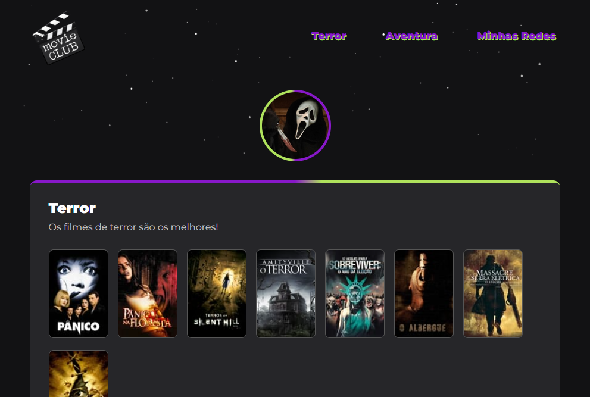

# Landing Page

> Trilha Explorer

Primeiro desafio do Stage02 da Rocketseat terminado com sucesso! Uma landing page simples porém muito bonita. Utilizamos o figma para fazer esse projeto.

[🔗 Clique aqui para acessar](https://filipesantos07.github.io/Rocketseat-Desafio01-Stage02/)

## 🛠️ Tecnologias

- HTML
- CSS

## 💛 Contato

outerspaceguy@live.co.uk
